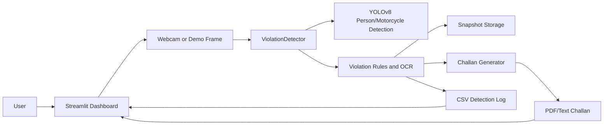
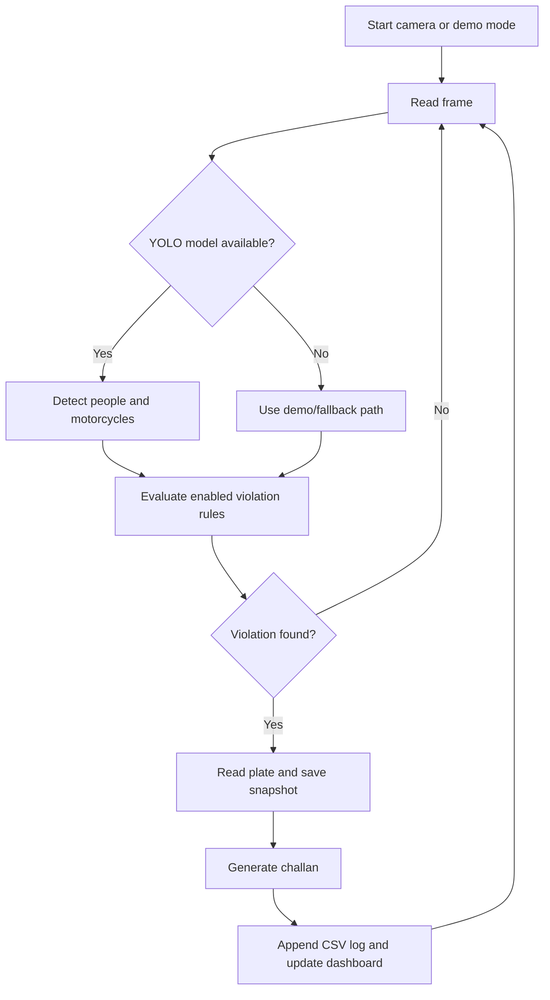
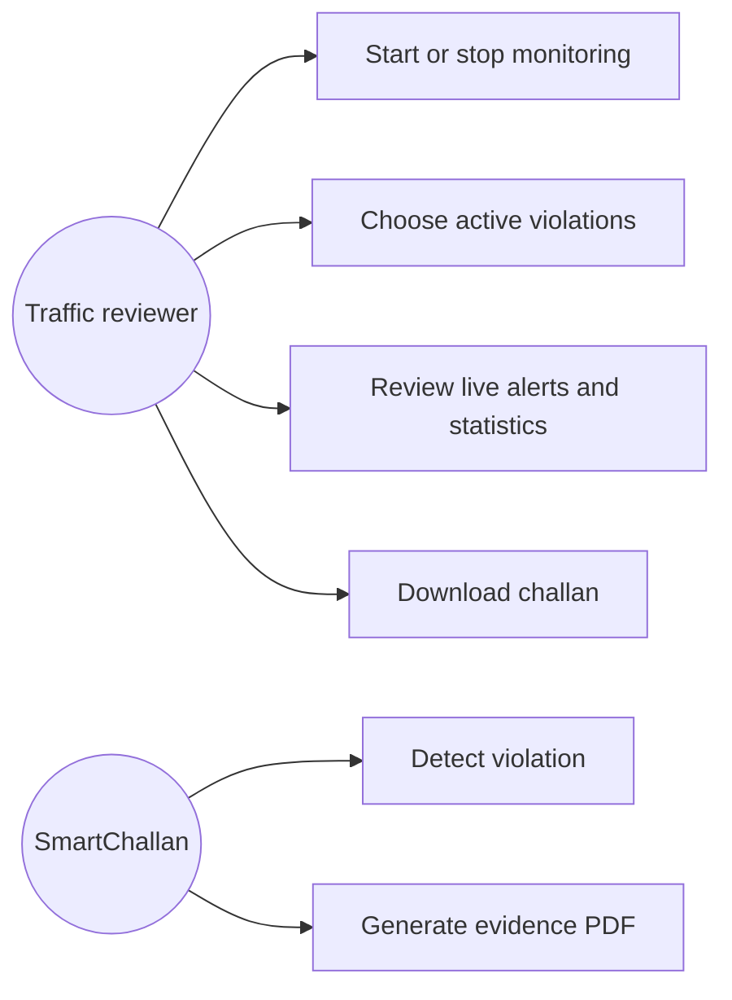
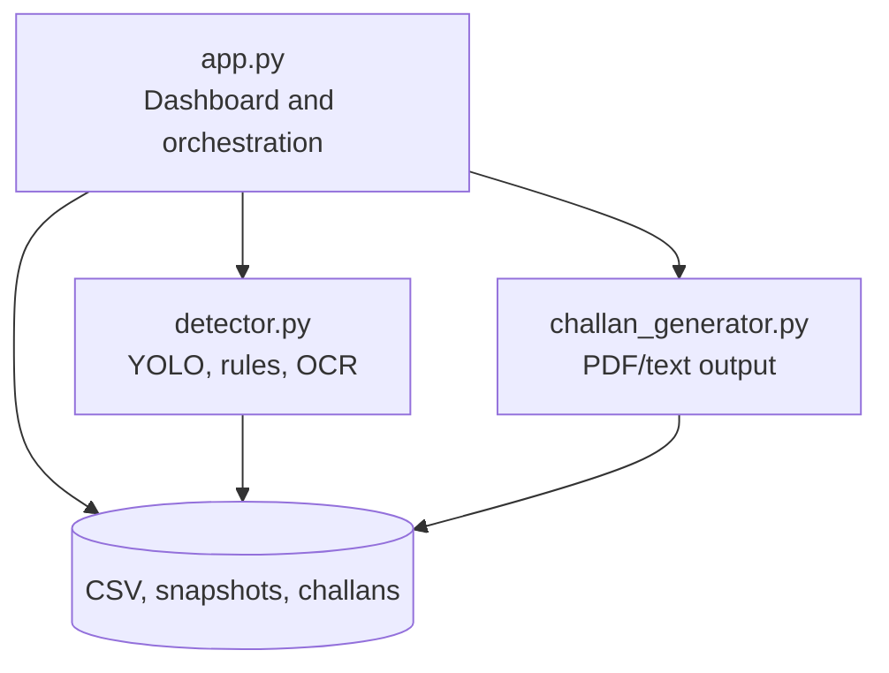
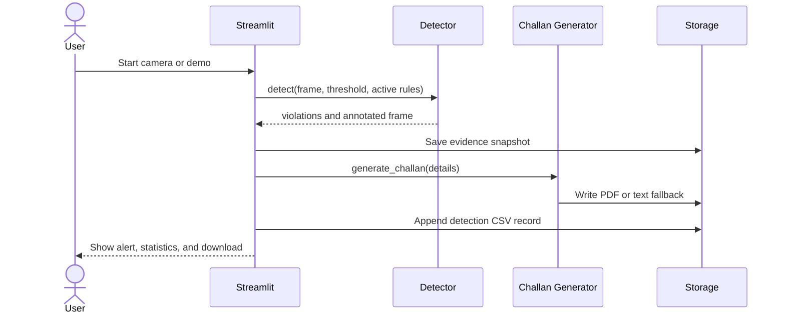

# SmartChallan Design Artefacts

## System Architecture

## Workflow Diagram

## Use Case Diagram

## Component Diagram

## Sequence Diagram

## Storage Design

The CSV log uses the following schema:

| Column | Meaning |
|---|---|
| `timestamp` | Detection time |
| `violation` | Violation category |
| `plate` | OCR or fallback plate value |
| `confidence` | Model confidence |
| `challan_id` | Generated unique identifier |
| `snapshot` | Evidence image path |